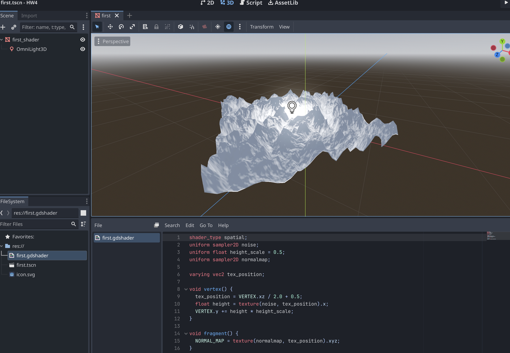
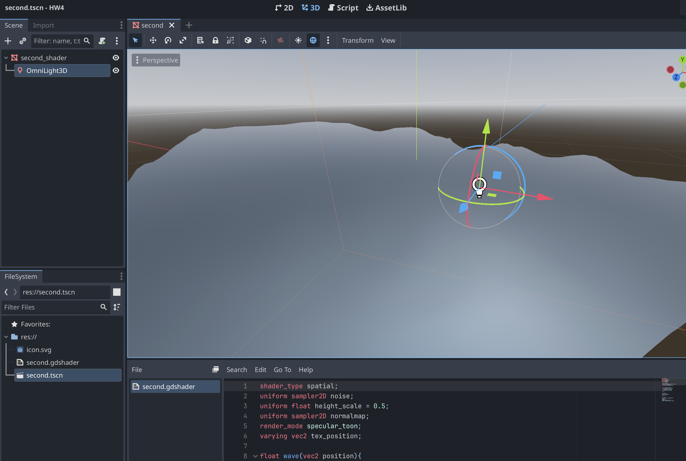
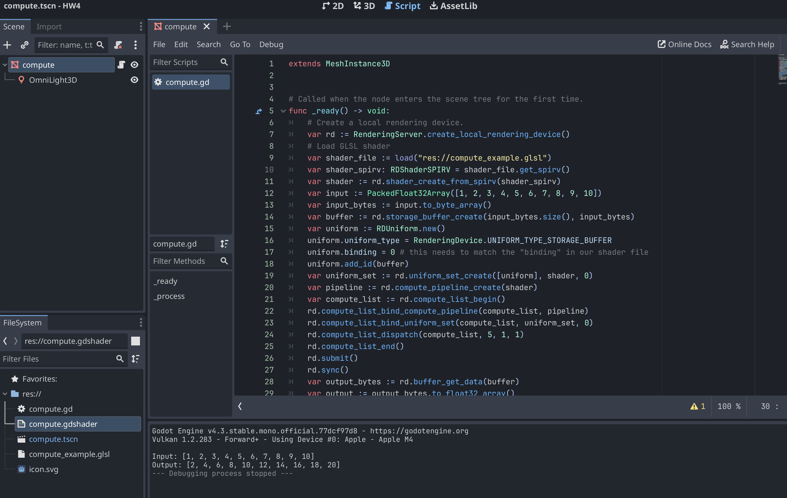
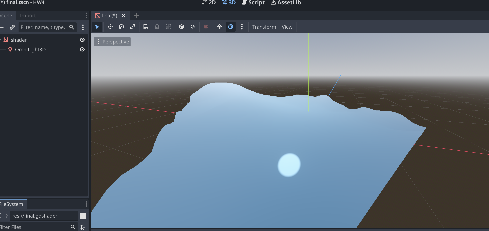

This is the Assignment4 for Xueqi Cheng

## Introduction

The assignment is to create 3D shaders using Godot. The details of each task is shown below.

## Task 1
The code is in the "First_shader", "Second_shader" and "compute_shader" folders. The results are shown below:

## Task 2
Wave deformation (vertex) + water reflection (fragment). Code is shown in Task2 folder. The result is shown below:

## Task 1.3
Code is shown in Task3 folder.